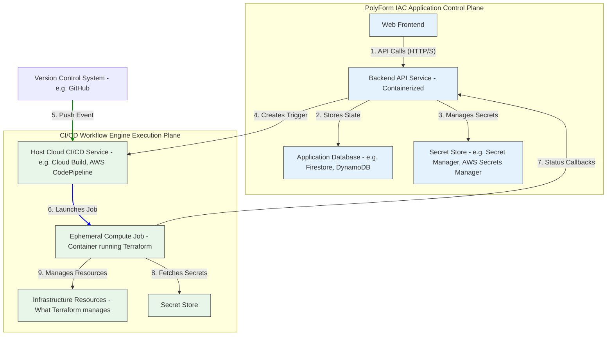

# PolyForm IAC

PolyForm IAC is a self-hosted, serverless-first control plane for managing Terraform workflows. It is designed for developers and teams who want a simple, secure, and cost-effective way to implement Infrastructure as Code (IaC) CI/CD.

Users deploy PolyForm IAC directly into their own cloud account. From a centralized UI, they can connect their Git repositories, securely manage variables, and automate `terraform plan` and `apply` cycles. The vision is to provide a "single pane of glass" for infrastructure automation that is both powerful and entirely within the user's security and cost domain.

_PolyForm IAC architecture diagram_



- [Project overview](#project-overview)
- [Folders structure](#folders-structure)
- [Starting your project](#starting-your-project)
- [Developing your project](#developing-your-project)
- [Deploying your project](#deploying-your-project)

And some words [about the Gowebly CLI](#about-the-gowebly-cli).

## Project overview

Backend:

- Module name in the go.mod file: `github.com/discoverlance-com/polyform-iac`
- Go web framework/router: `Gin`
- Server port: `8080`

Frontend:

- Package name in the package.json file: `polyform-iac`
- Reactivity library: `htmx with Alpine.js`
- CSS framework: `Tailwind CSS with Preline UI components`

Tools:

- Air tool to live-reloading: ✓
- Templ to generate HTML: ✓
- Config for golangci-lint: ✓

## Folders structure

```console
.
├── assets
│   ├── scripts.js
│   └── styles.css
├── static
│   ├── images
│   │   └── gowebly.svg
│   ├── apple-touch-icon.png
│   ├── favicon.ico
│   ├── favicon.png
│   ├── favicon.svg
│   ├── manifest-desktop-screenshot.jpeg
│   ├── manifest-mobile-screenshot.jpeg
│   ├── manifest-touch-icon.svg
│   └── manifest.webmanifest
├── templates
│   ├── pages
│   │   └── index.templ
│   └── main.templ
├── .gitignore
├── .dockerignore
├── .prettierignore
├── .air.toml
├── golangci.yml
├── Dockerfile
├── docker-compose.yml
├── prettier.config.js
├── package.json
├── go.mod
├── go.sum
├── handlers.go
├── server.go
├── main.go
└── README.md
```

## Starting your project

> ❗️ Please make sure that you have installed the executable files for all the necessary tools before starting your project. Exactly:
>
> - `Air`: [https://github.com/air-verse/air](https://github.com/air-verse/air)

> - `Templ`: [https://github.com/a-h/templ](https://github.com/a-h/templ)
> - `golangci-lint`: [https://github.com/golangci/golangci-lint](https://github.com/golangci/golangci-lint)

To start your project, run the **Gowebly** CLI command in your terminal:

```console
gowebly run
```

## Developing your project

The backend part is located in the `*.go` files in your project folder.

The `./templates` folder contains Templ templates that you can use in your frontend part. Also, the `./assets` folder contains the `styles.scss` (main styles) and `scripts.js` (main scripts) files.

The `./static` folder contains all the static files: icons, images, PWA (Progressive Web App) manifest and other builded/minified assets.

## Deploying your project

All deploy settings are located in the `Dockerfile` and `docker-compose.yml` files in your project folder.

To deploy your project to a remote server, follow these steps:

1. Go to your hosting/cloud provider and create a new VDS/VPS.
2. Update all OS packages on the server and install Docker, Docker Compose and Git packages.
3. Use `git clone` command to clone the repository with your project to the server and navigate to its folder.
4. Run the `docker-compose up` command to start your project on your server.

> ❗️ Don't forget to generate Go files from `*.templ` templates before run the `docker-compose up` command.

## About the Gowebly CLI

The [**Gowebly**](https://github.com/gowebly/gowebly) CLI is a next-generation CLI tool that makes it easy to create amazing web applications with **Go** on the backend, using **htmx**, **hyperscript** or **Alpine.js**, and the most popular **CSS frameworks** on the frontend.

It's highly recommended to start exploring the Gowebly CLI with short articles "[**What is Gowebly CLI?**](https://gowebly.org/getting-started)" and "[**How does it work?**](https://gowebly.org/getting-started/how-does-it-work)" to understand the basic principle and the main components built into the **Gowebly** CLI.

<a href="https://gowebly.org/" target="_blank"></a>
